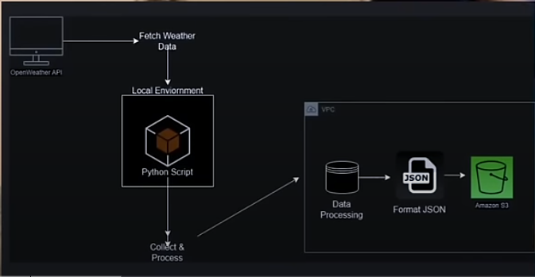
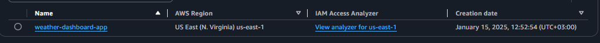
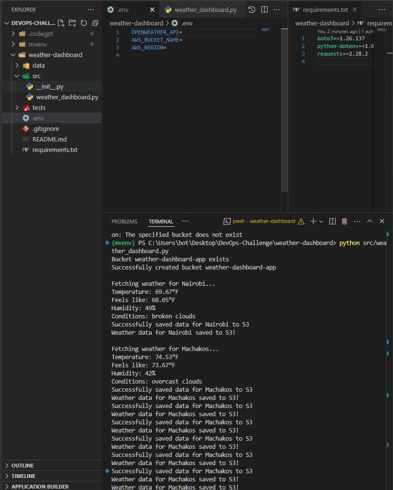

# 30 Days DevOps Challenge - Weather Dashboard App



Day 1: Building a weather data collection system using AWS S3 and OpenWeather API

---

# Weather Data Collection System - DevOps Day 1 Challenge

## Project Overview
This project is a Weather Data Collection System that demonstrates core DevOps principles by combining:
- External API Integration (OpenWeather API)
- Cloud Storage (AWS S3)

- Infrastructure as Code
- Version Control (Git)
- Python Development
- Error Handling
- Environment Management

## Features
- Fetches real-time weather data for multiple cities

- Displays temperature (°F), humidity, and weather conditions
- Automatically stores weather data in AWS S3
- Supports multiple cities tracking
- Timestamps all data for historical tracking

## Technical Architecture


- **Language:** Python 3.x
- **Cloud Provider:** AWS (S3)
- **External API:** OpenWeather API
- **Dependencies:** 
  - boto3 (AWS SDK)
  - python-dotenv
  - requests

## Project Structure
```markdown
weather-dashboard/
  src/
    __init__.py
    weather_dashboard.py
  tests/
  data/
  .env
  .gitignore
  requirements.txt
  ```
